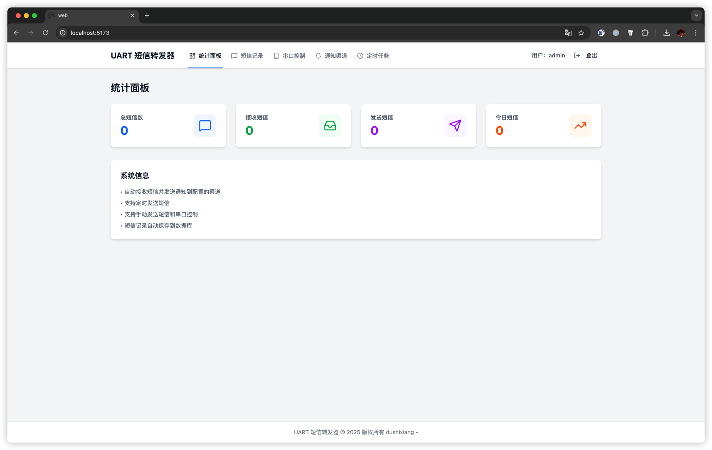
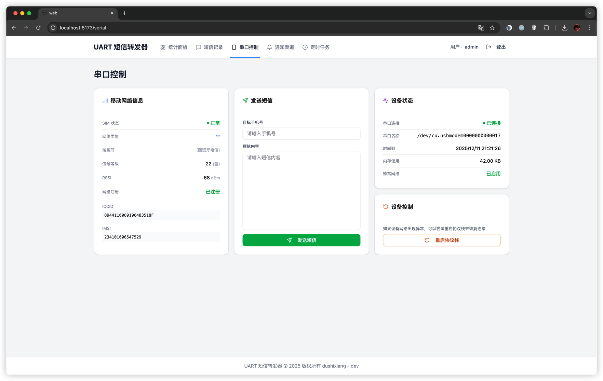
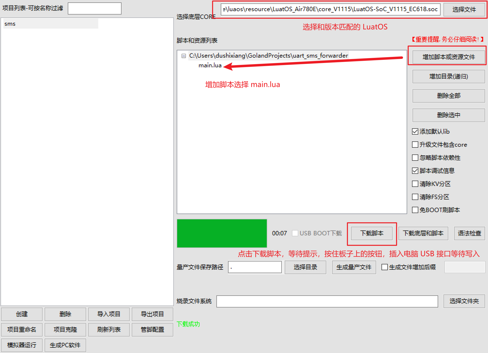
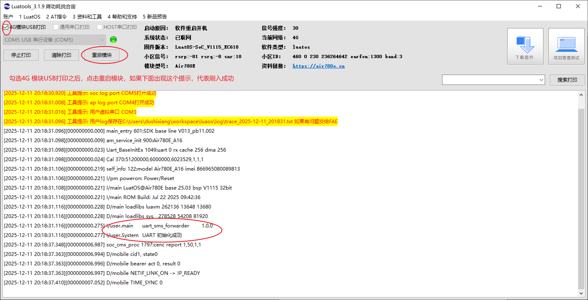

# 短信UART转发器

基于 合宙Air780 XXX 系列设备的短信转发系统，支持接收短信并通过串口转发到上位机。

[项目说明](https://blog.typesafe.cn/posts/air780e-giffgaff/)

**已测试设备**

- Air780EHV
- Air780EHM
- Air780E (可以使用，但属于过时设备，不建议购买)
- Air780EPV (可以使用，但属于过时设备，不建议购买)


## 🌟 功能特性

- 短信转发
- 短信记录
- 发送短信
- 来电通知
- 支持钉钉、企业微信、飞书、自定义 webhook、邮箱通知
- 计划任务发送短信

## 截图




## 🚀 快速开始

### 1. 硬件准备

**设备准备**：
- 插入有效的SIM卡
- 通过USB连接电脑

### 2. 烧录 Lua 脚本

使用 [**LuaTools**](https://docs.openluat.com/air780epm/common/Luatools/) 烧录 `main.lua` 脚本，第一次烧录需要点击 「下载底层和脚本」



### 3. 测试



### 4. 把设备插入到你的小主机等 Linux USB上


### 5. 运行上位机程序

#### docker 方式安装

```shell
# 创建空目录
mkdir /opt/uart_sms_forwarder
# 下载 docker-compose.yml 文件
wget https://raw.githubusercontent.com/dushixiang/uart_sms_forwarder/main/docker-compose.yml -O /opt/uart_sms_forwarder/docker-compose.yml
# 下载 config.example.yaml 文件
wget https://raw.githubusercontent.com/dushixiang/uart_sms_forwarder/main/config.example.yaml -O /opt/uart_sms_forwarder/config.yaml
```

修改 `docker-compose.yml` 和 `config.yaml` 文件，主要是映射 USB 路径和修改密码。

启动服务

```shell
docker-compose up -d
```

打开浏览器访问 8080 端口。

----

#### 原生方式安装

下载

```shell
wget https://github.com/dushixiang/uart_sms_forwarder/releases/latest/download/uart_sms_forwarder-linux-amd64.tar.gz
```

解压
```bash
tar -zxvf uart_sms_forwarder-linux-amd64.tar.gz -C /opt/
mv /opt/uart_sms_forwarder-linux-amd64 /opt/uart_sms_forwarder
```

创建系统服务

```shell
cat <<EOF > /etc/systemd/system/uart_sms_forwarder.service
[Unit]
Description=uart_sms_forwarder service
After=network.target

[Service]
User=root
WorkingDirectory=/opt/uart_sms_forwarder
ExecStart=/opt/uart_sms_forwarder/uart_sms_forwarder
TimeoutSec=0
RestartSec=10
Restart=always
LimitNOFILE=1048576

[Install]
WantedBy=multi-user.target
EOF
```

创建 sqllite 目录

```shell
mkdir /opt/uart_sms_forwarder/data
```

启动服务

```shell
systemctl daemon-reload
systemctl enable uart_sms_forwarder
systemctl start uart_sms_forwarder
```

打开浏览器访问 8080 端口。

修改密码等配置项，请参考 [config.example.yaml](config.example.yaml) 文件。


